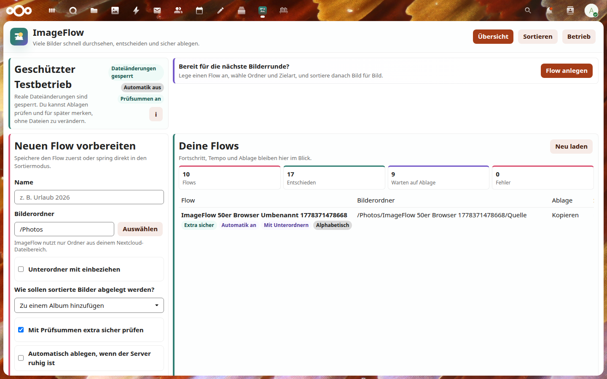
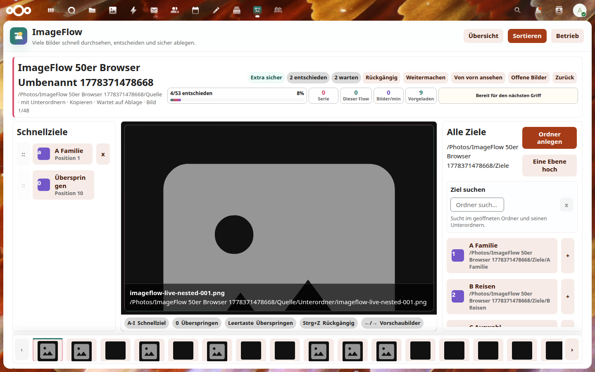
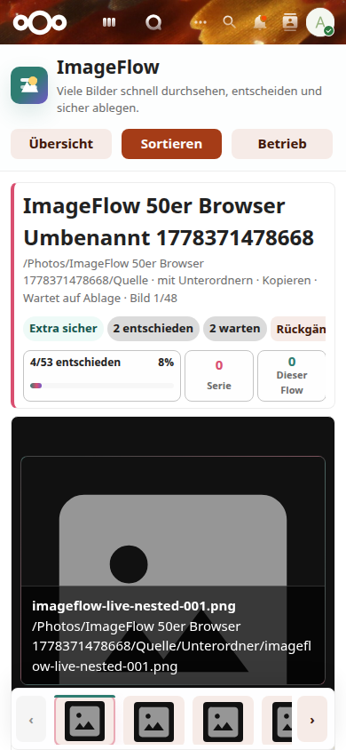

# ImageFlow

ImageFlow is a Nextcloud app for fast, controlled sorting of large image folders. It is built around flows: choose a source folder, decide whether images should go to albums, be copied, or be moved, sort quickly, then review and release the filing work explicitly.

Current status: v1 production candidate for Nextcloud 33. Real file writes are disabled by default. Sorting decisions are stored as assignments and queue items first; manual or background processing must be enabled by an administrator in a controlled window.



## What It Does

- Flow dashboard with create, save, edit, duplicate, pause, review and processing controls.
- Responsive sorting workspace with quick targets, large stable photo stage, all targets, target creation and thumbnail strip.
- Game-like feedback with streaks, images per minute, progress meter, hotkeys and quick animations.
- Fast target search for albums and folder targets directly in the sorting rail.
- Hotkeys for `1-9`, `A-I`, custom quick-target keys, `0`, `Space`, undo and arrow-key thumbnail navigation.
- Bounded image preload modes for light, balanced and turbo sorting.
- Folder and album APIs with explicit user-triggered target creation.
- Undo for recent decisions and removable planned worklist items before execution.
- Worklist review with warnings, duplicate handling, checksum-safe copy/move checks and compact filters for large queues.
- Guarded manual and background queue processing behind server-side flags.
- Admin operation page for real-write and cron gates.
- German and English UI based on the selected Nextcloud user language; more languages can be added in the UI dictionary.
- User-visible diagnosis export with settings, queue counts, background gate state and redacted logs.





## Workflow

1. Create a flow and choose the image folder.
2. Pick the filing mode: album, copy to folder, or move to folder.
3. Sort images by clicking a target or pressing the assigned hotkey.
4. When all open images are decided, click **Review filing**.
5. Review warnings, duplicates and readiness.
6. Release the worklist, then run it manually or let the background job process it when the server is quiet.


## Installation

Clone the repository and copy the app folder into Nextcloud's app directory:

```bash
cd /var/www/nextcloud/apps
git clone https://github.com/desCo323/ImageFlow.git imageflow-repo
cp -a imageflow-repo/imageflow ./imageflow
sudo -u www-data php /var/www/nextcloud/occ app:enable imageflow
```

For updates, create a backup first, then update the app folder and run the repair step:

```bash
cd /var/www/nextcloud/apps/imageflow-repo
git pull
sudo rsync -a --delete --exclude='node_modules' --exclude='test-results' imageflow/ /var/www/nextcloud/apps/imageflow/
sudo chown -R www-data:www-data /var/www/nextcloud/apps/imageflow
sudo -u www-data php /var/www/nextcloud/occ app:update imageflow
sudo -u www-data php /var/www/nextcloud/occ maintenance:repair
```

Admin settings are available in Nextcloud under **Settings -> Administration -> ImageFlow**.

## Local Checks

```bash
bash scripts/self-check.sh
npm run test:browser
```

Authenticated live tests are opt-in and must use the dedicated test account:

```bash
IMAGEFLOW_BASE_URL=https://chaosnet.me \
IMAGEFLOW_TEST_USER=albentest \
IMAGEFLOW_TEST_PASSWORD='<runtime-only>' \
npm run test:browser:auth
```

Real file-write coverage is a separate opt-in test:

```bash
IMAGEFLOW_AUTH_TESTS=1 IMAGEFLOW_REAL_WRITE_TESTS=1 \
IMAGEFLOW_BASE_URL=https://chaosnet.me \
IMAGEFLOW_TEST_USER=albentest \
IMAGEFLOW_TEST_PASSWORD='<runtime-only>' \
npx playwright test tests/Browser/real-execution-live.auth.spec.js --workers=1 --trace=off --reporter=line
```

## Manual Safe Test

See `docs/SELF_TEST.md` for the deployed self-test checklist and screenshot locations.
See `docs/V1_VERIFICATION.md` for the latest v1 production verification, backup references and browser test matrix.

## Safety

Do not deploy this app to a production Nextcloud instance without the documented backup and rollback process. Authenticated tests may only use the dedicated test user `albentest`; credentials must never be stored in this repository. Before any real-write test, create a backup and verify the admin operation settings afterwards.
