# ImageFlow Screenshots

These screenshots use the local mock UI, not a live Nextcloud account, so no private files or photos are included.

## Development Screenshots

Screenshots 1-9 document the earlier safety and worklist blocks. Screenshots 10-12 show the lighter round terminology and game-like sorting feedback.

1. Dashboard and job management  
   

2. Source folder picker  
   

3. Sorting workspace in album mode  
   

4. Editable favorites  
   

5. Folder target navigation in copy/move mode  
   

6. Mobile sorting workspace  
   

7. Worklist dry-run preview before execution
   

8. Worklist safety preview with execution guard
   

9. Worklist queued state after confirmation
   

10. Round overview with lighter terminology
   

11. Sorting workspace with round progress bar
   

12. Decision feedback after adding an image to a quick target
   

13. Round controls with automatic processing and buffer mode
   

14. Ablage processing options
   

15. Debug protocol view
   

16. Overview self-test protection status
   

17. Large filmstrip with next-page prefetch
   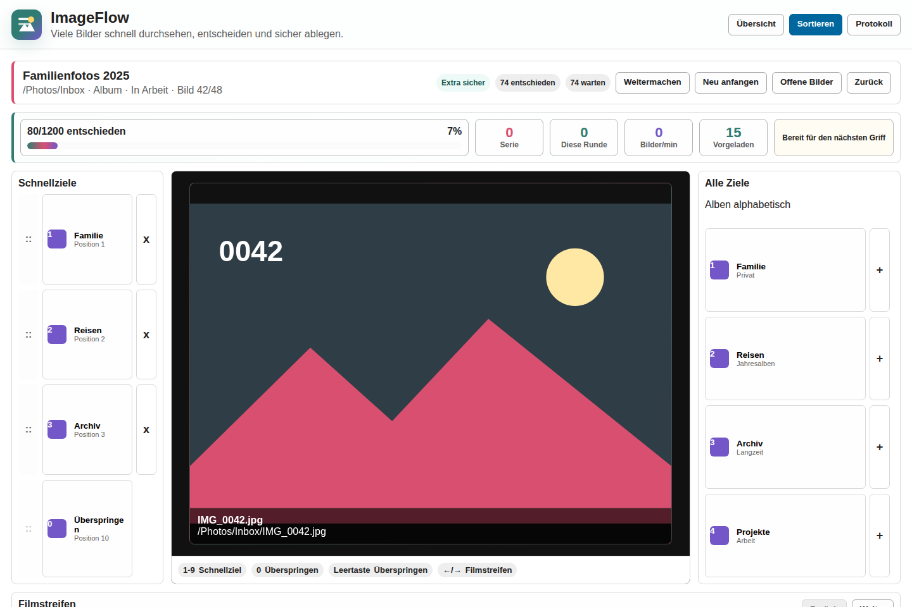

18. Round dashboard with save, edit, duplicate and processing controls
   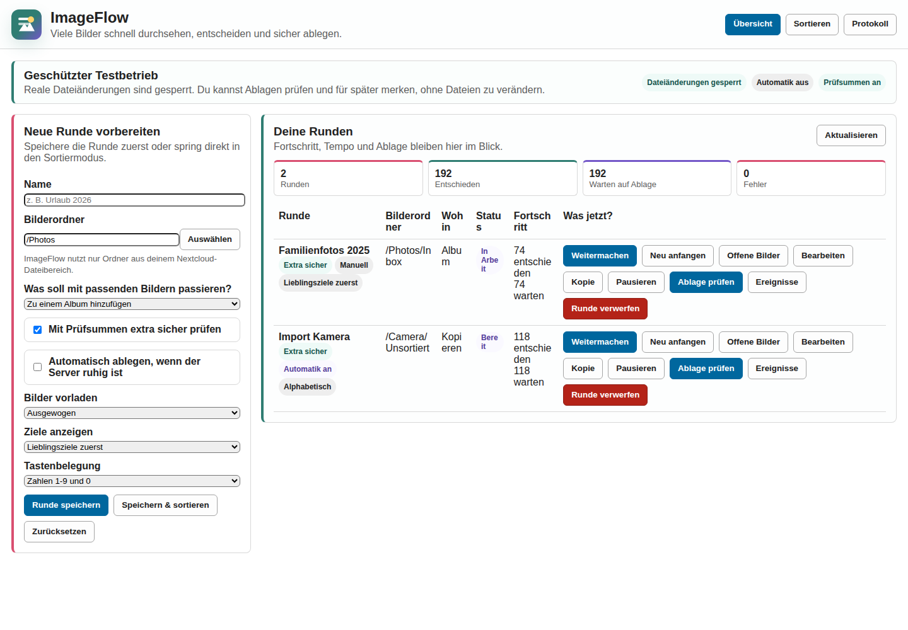

19. Round editing form from the overview
   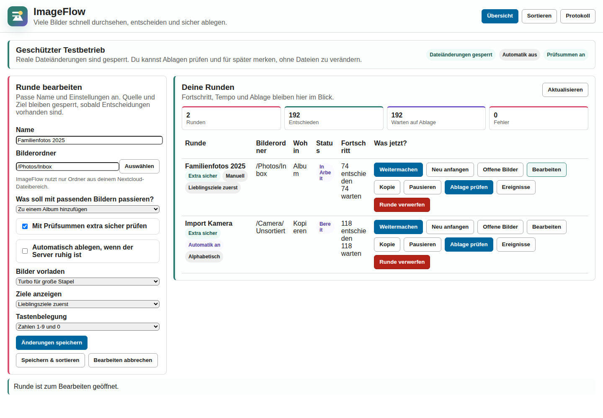

20. Sorting workspace with letter hotkeys
   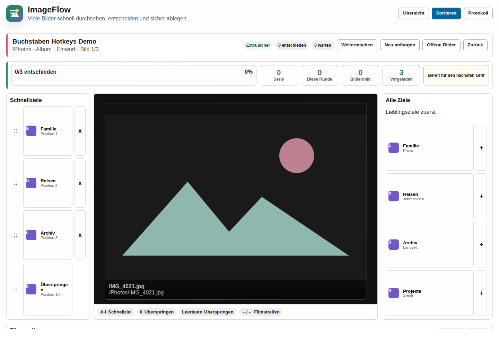

21. Round setup with freely configured quick-target hotkeys
   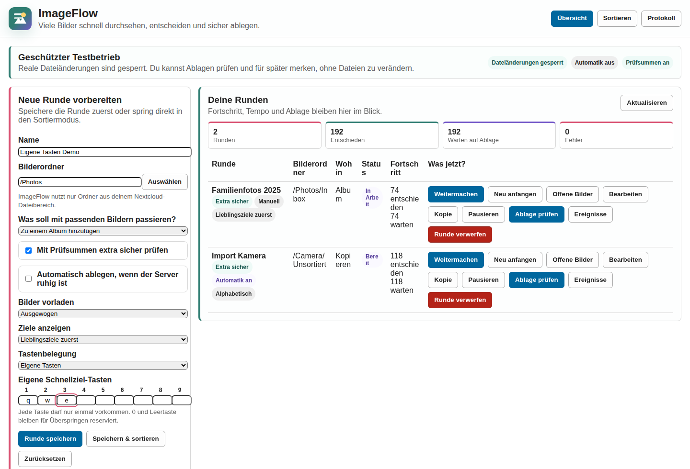

22. Sorting workspace with direct target creation and undo control
   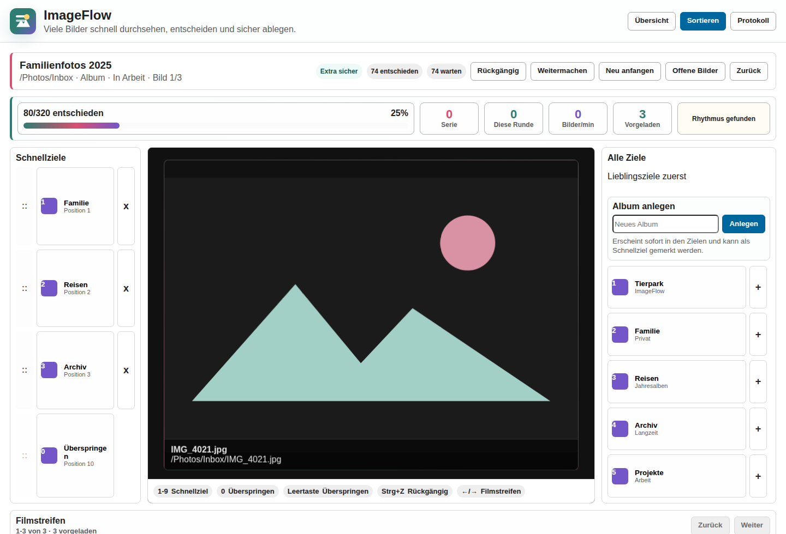

23. Worklist preview after removing one planned item
   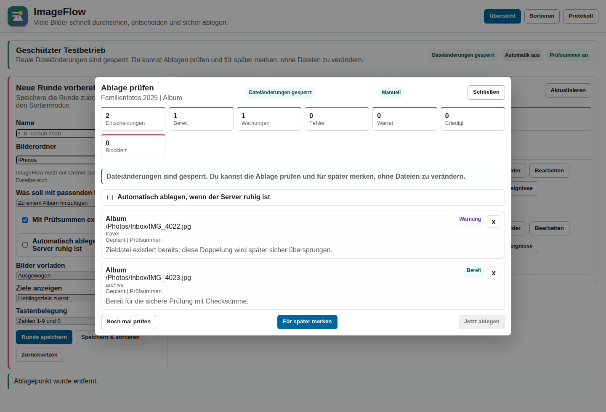

24. Background processing waits for a quiet server window
   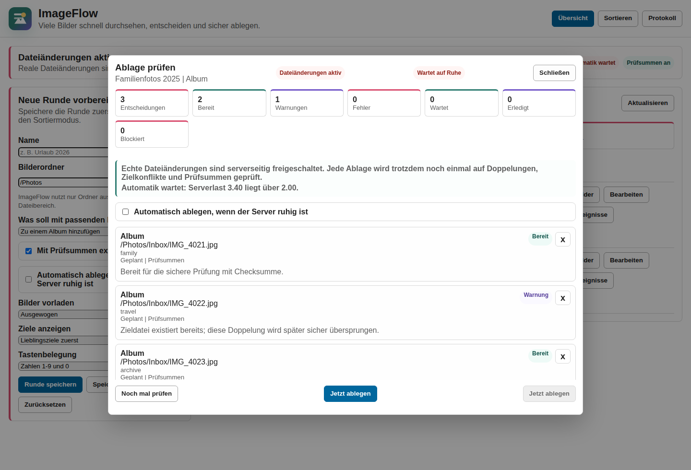

25. Sorting workspace target search
   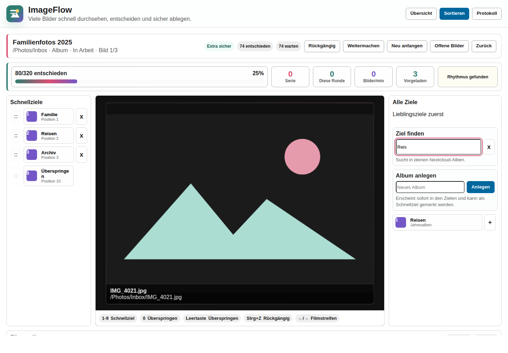

26. Large Ablage preview with compact filters
   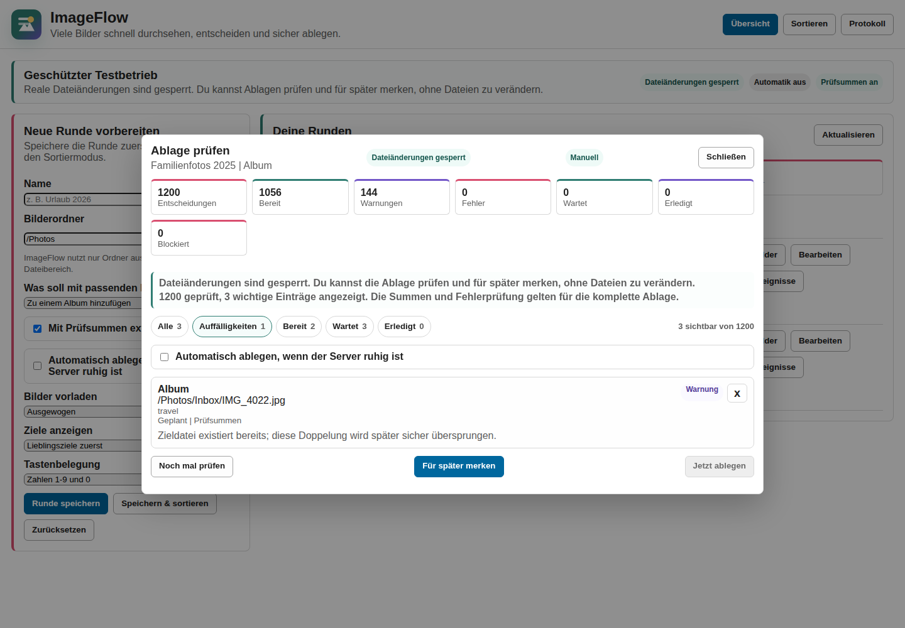

27. Dashboard system check and guided self-test
   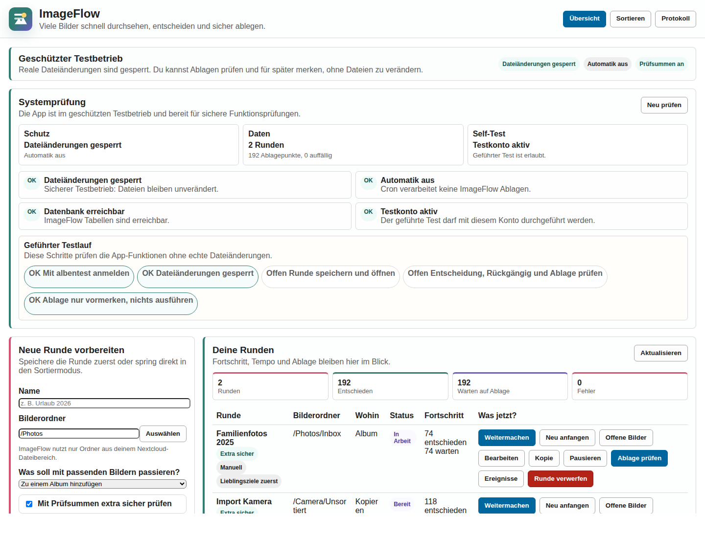

28. Dashboard with visible Flow creation action
   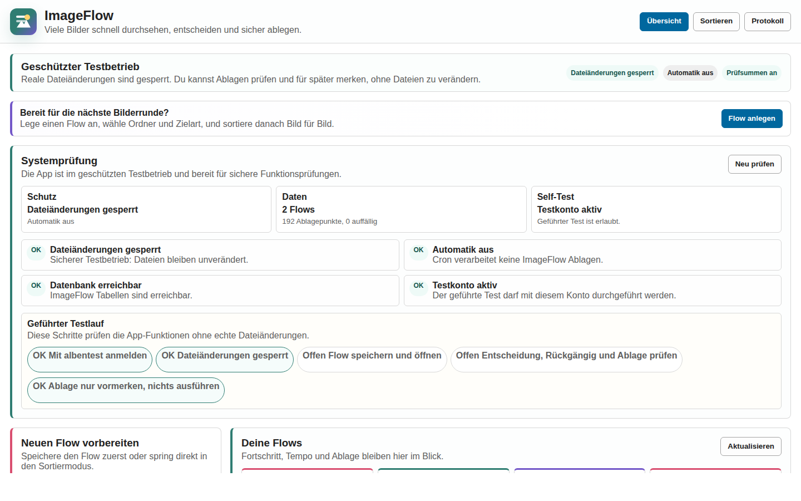

29. Stable sorting workspace with visible filmstrip footer
   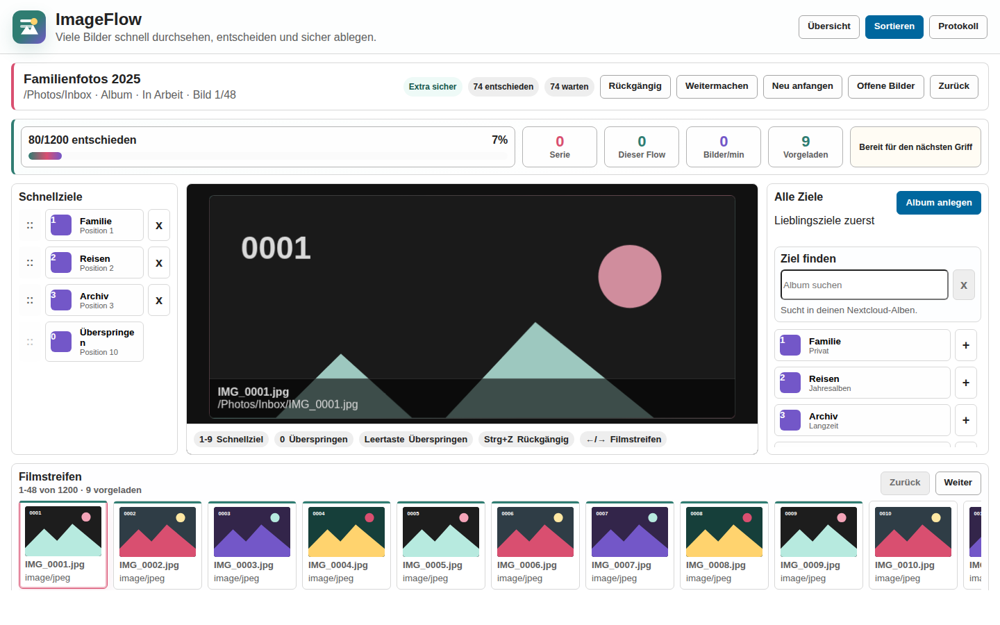

30. Live narrow Nextcloud layout with visible create button and filmstrip
   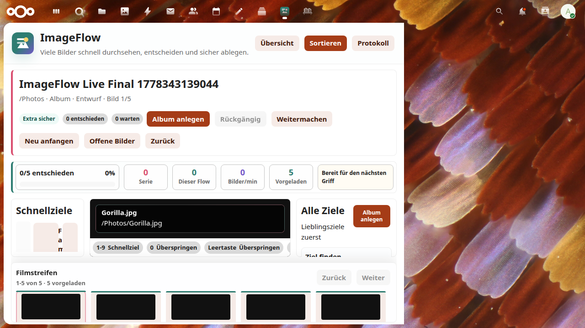

31. Responsive desktop Flow with compact header and image-only filmstrip
   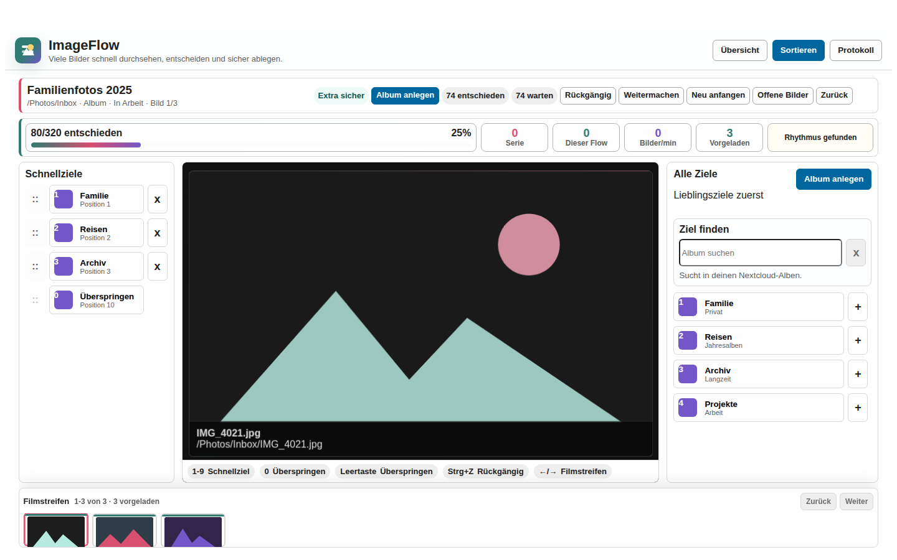

32. Responsive mobile Flow with photo-first sorting layout and compact filmstrip
   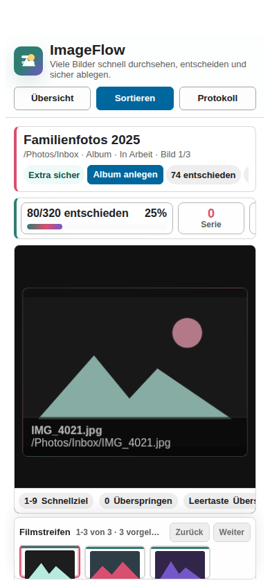
