# ImageFlow Screenshots

These screenshots use the local mock UI, not a live Nextcloud account, so no private files or photos are included.

## Development Screenshots

Screenshots 1-9 document the earlier safety and worklist blocks. Screenshots 10-12 show the current Flow terminology and game-like sorting feedback.

1. Dashboard and job management  
   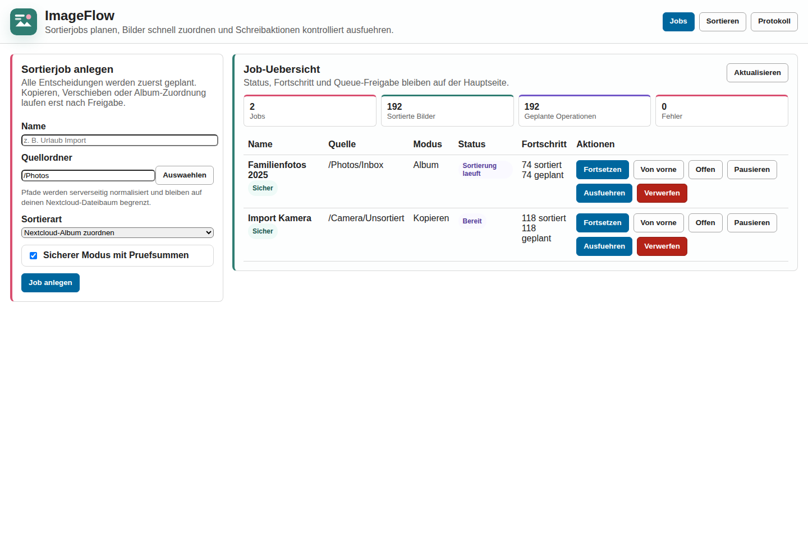

2. Source folder picker  
   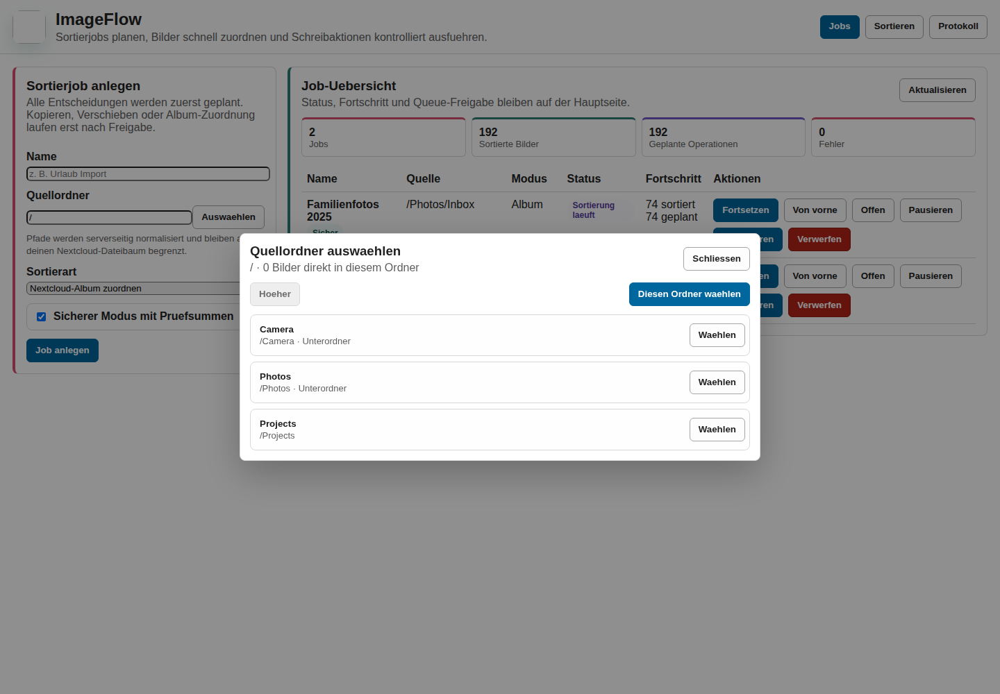

3. Sorting workspace in album mode  
   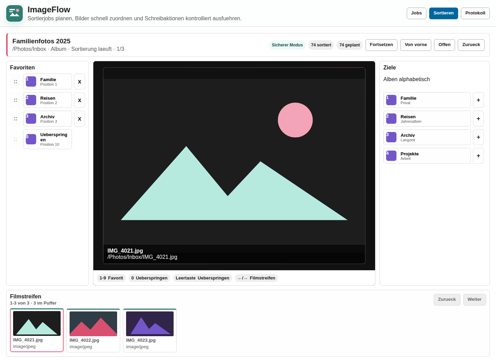

4. Editable favorites  
   

5. Folder target navigation in copy/move mode  
   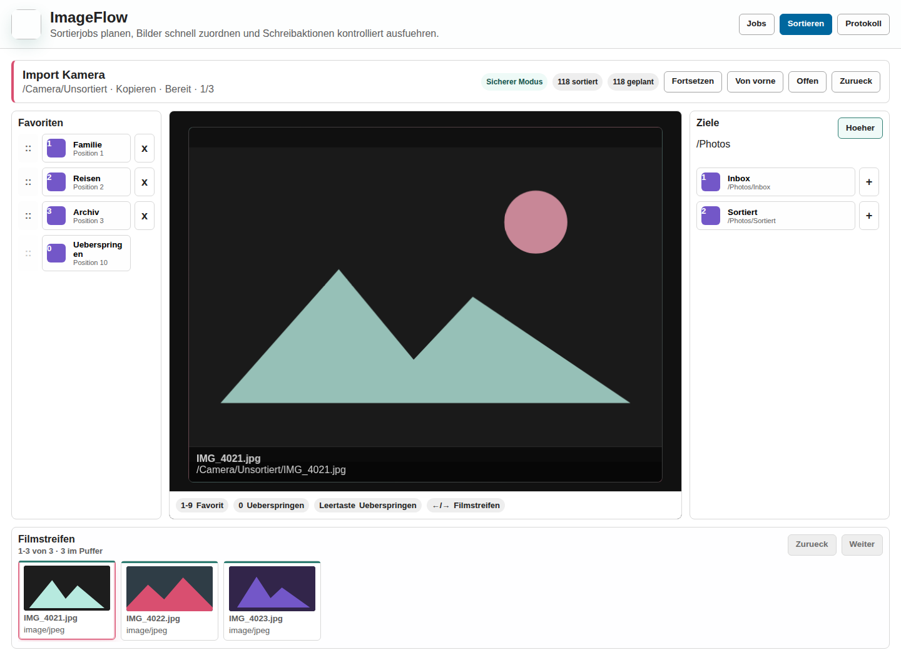

6. Mobile sorting workspace  
   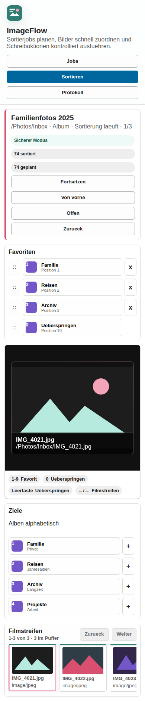

7. Worklist dry-run preview before execution
   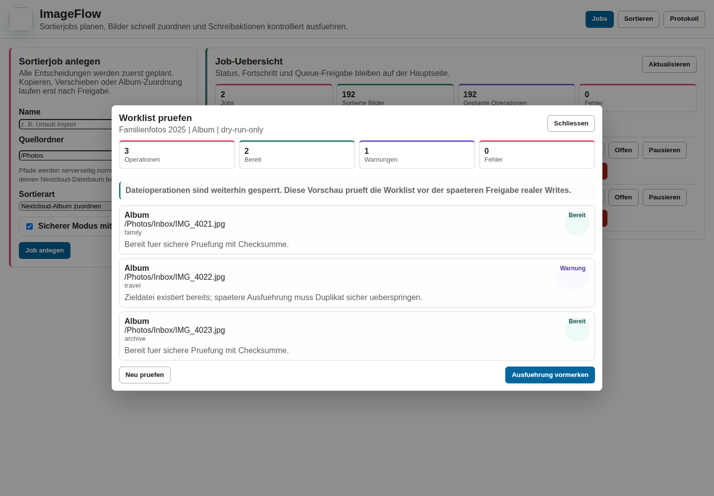

8. Worklist safety preview with execution guard
   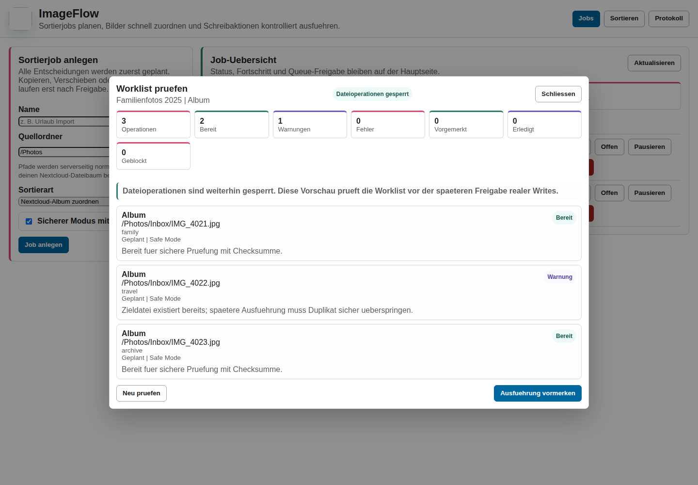

9. Worklist queued state after confirmation
   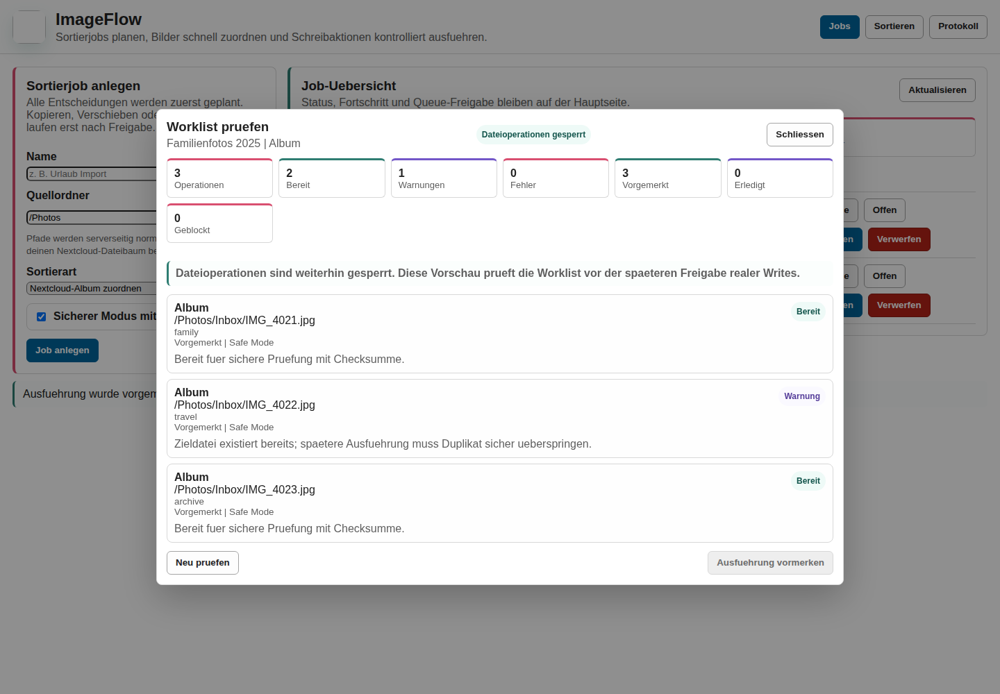

10. Flow dashboard with lighter terminology
   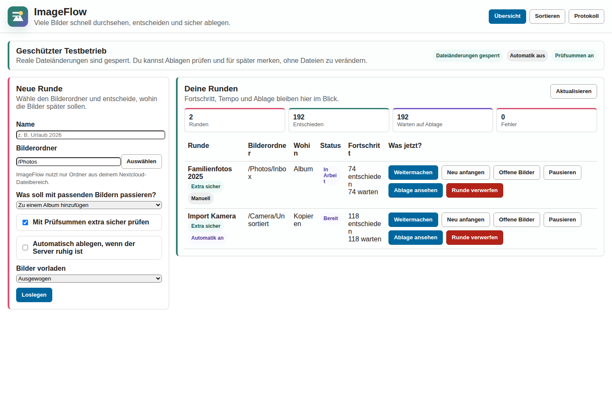

11. Sorting workspace with Flow progress bar
   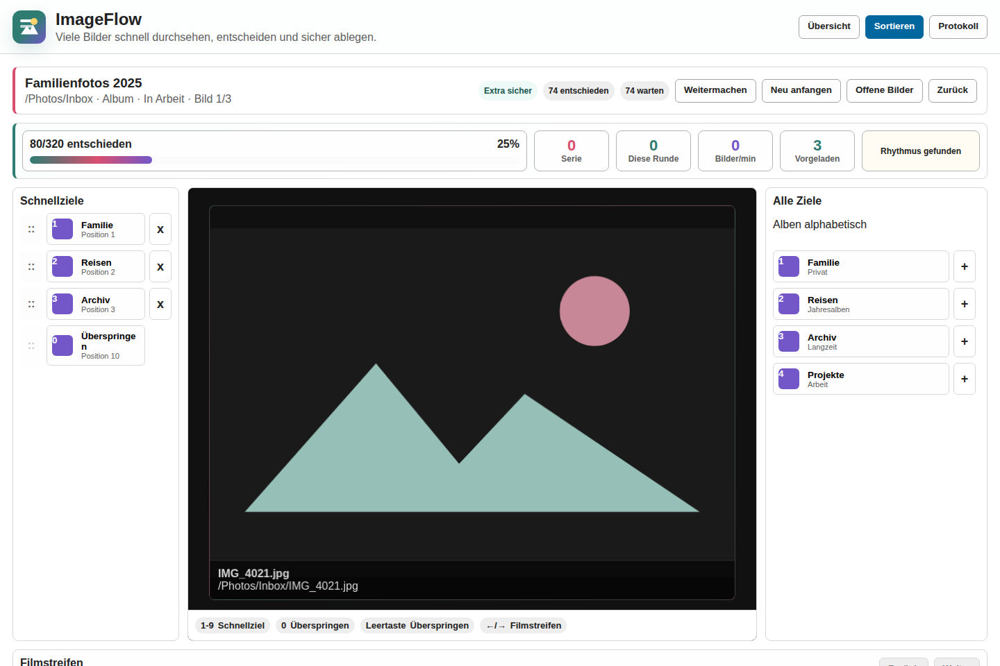

12. Decision feedback after adding an image to a quick target
   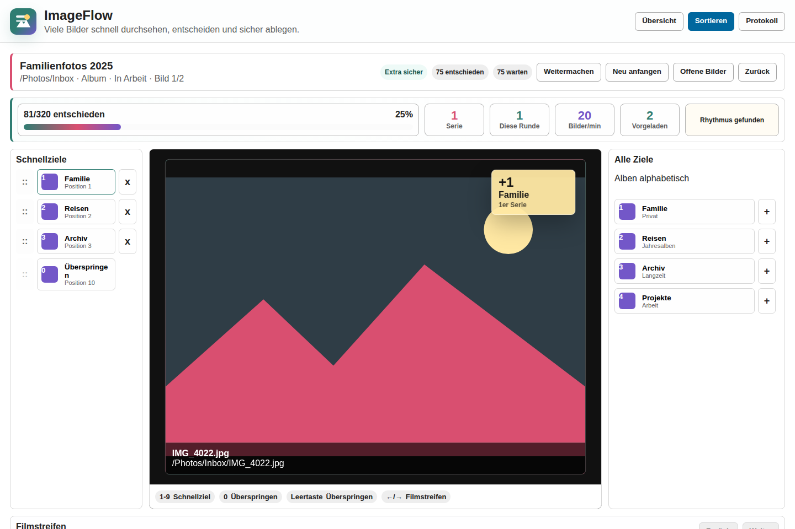

13. Final Flow controls with automatic processing and buffer mode
   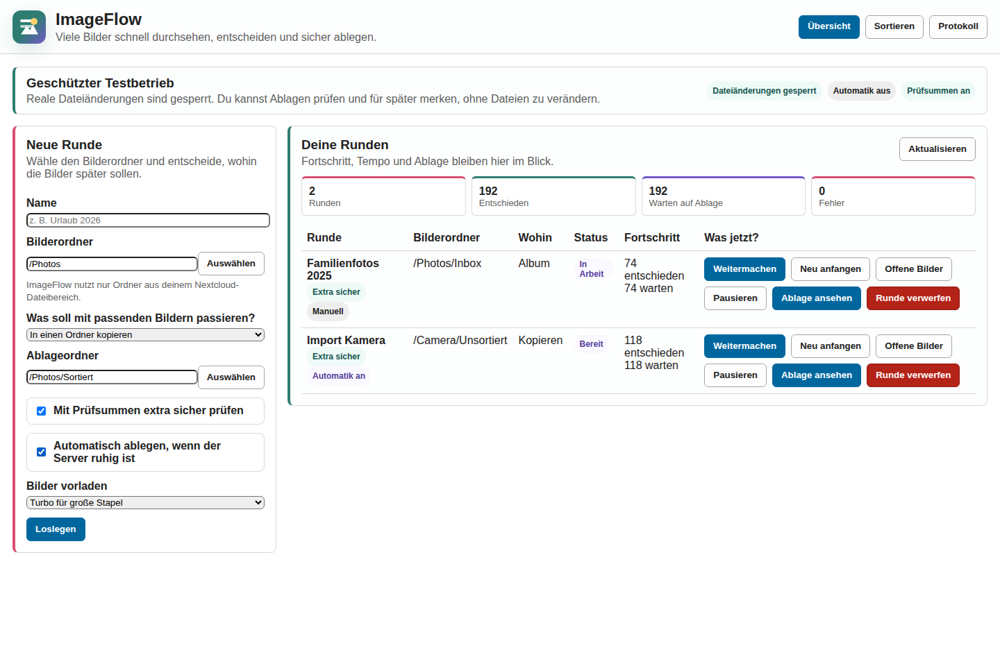

14. Worklist processing options
   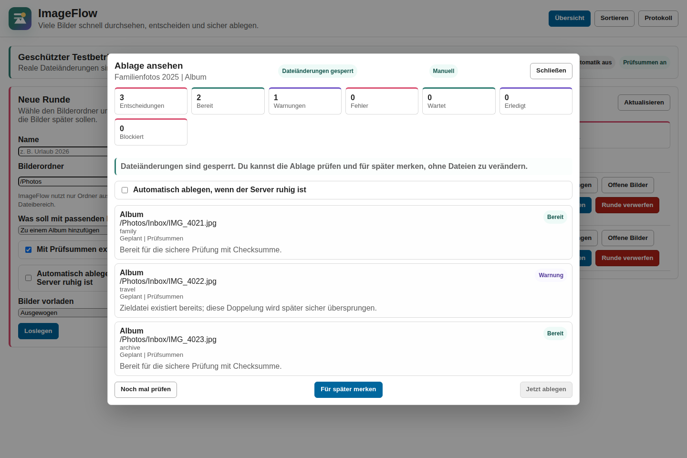

15. Debug protocol view
   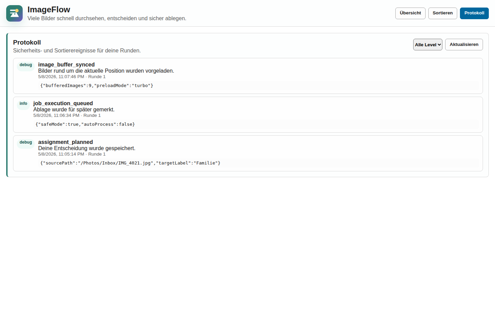

16. Dashboard self-test safety status
   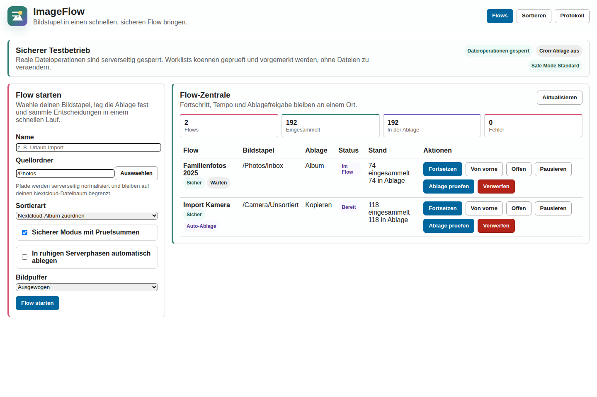
